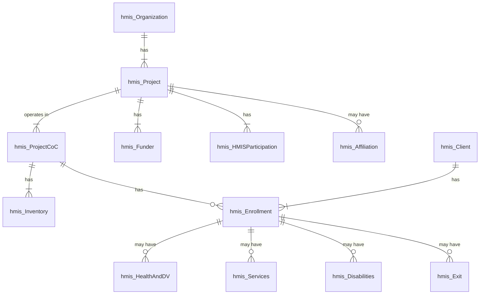

# HMIS Business Logic: Core Concepts

The universe of HMIS project, client, and enrollment data used to
generate the LSA is broad in scope. It uses systemwide enrollment data
for HMIS-participating continuum ES, SH, TH, RRH, and PSH projects and
includes project descriptor data for OPH projects. It may include
enrollments with exit dates and projects with operating end dates as far
back as the <ins>LookbackDate</ins> (<ins>ReportStart</ins> – 7 years).

The HMIS data required for the LSA are shown below. 

    
The business logic in this section defines core concepts: report
parameters, reporting cohorts, basic criteria for record selection, and
identification of household types in various contexts.

Any given enrollment may be relevant for a variety of reporting
purposes, each of which has specific criteria, but there is a common set
of criteria that applies to the identification of relevant HMIS data in
every aspect of LSA reporting.

There are also adjustments to HMIS move-in and exit dates that may be
required to resolve conflicts with other HMIS data that apply regardless
of how a particular enrollment is being used for reporting.

To simplify subsequent steps and to reduce repetition, the logic
associated with selection of valid enrollments and resolution of data
conflicts is described here for all HMIS *HouseholdID*s active on or
after LookbackDate in HMIS-participating continuum ES/SH/TH/RRH/PSH
projects that meet the core criteria.

As described, it is a process that creates records in two ‘temporary
tables’ – tlsa_HHID and tlsa_Enrollment. They are highly de-normalized
and include both HMIS data (e.g., *ProjectID*) and calculated variables
(e.g., **HHType**) that are set once in these tables and referenced
repeatedly in subsequent steps.

- A record is created in tlsa_HHID for each *HouseholdID* with columns
  for frequently used data, including effective/adjusted move-in and
  exit dates where relevant (section 3.3).

- A record is created in tlsa_Enrollment for each validated
  *EnrollmentID* with columns for frequently used data, including
  effective/adjusted move-in and exit dates where relevant (section
  3.4).

Household type is determined by the ages of household members. The
calculation of age and household type is context-dependent – some
processes require household type based on ages at project entry; others
require household type based on age at the later of project entry or the
start of a given cohort period. As described:

There are multiple age columns in tlsa_Enrollment (**EntryAge**,
**ActiveAge**, etc.) and multiple household type columns in tlsa_HHID
(**EntryHHType**, **ActiveHHType**, etc.). Descriptions of business
logic associated with age and household type processes are not repeated
in subsequent sections.

hmis_Client

## Report Parameters and Metadata (lsa_Report)

User-entered report parameters are included in LSAReport for upload to
HDX 2.0. When they are applied in subsequent steps, their source is
represented in graphics using lsa_Report. References to individual
report parameters are always underlined – e.g., <ins>ReportStart</ins> – in
descriptions of business logic.

### Relevant Data

#### Source

User-entered and vendor-provided data.

#### Target

| LSAReport      |
|----------------|
| ReportID       |
| ReportStart    |
| ReportEnd      |
| ReportCoC      |
| LSAScope       |
| SoftwareVendor |
| SoftwareName   |
| VendorContact  |
| VendorEmail    |

### Logic

#### ReportID 

**ReportID** is a system-generated integer that distinctly identifies an
instance of LSA output and is repeated in each of the CSV files to
confirm that they were produced together.

#### ReportStart

For the annual year-long LSA submitted to HUD, the report start date
must be the first day (October 1) of the fiscal year for which the LSA
is being produced.

For submission as the HIC, the report start date must be the date of the
count.

It must be possible for a user to select any date on or after October 1,
2018.

The data type for the column is date; values should be formatted as
‘yyyy-mm-dd’.

#### ReportEnd

For the annual year-long LSA submitted to HUD, this must be the last day
(September 30) of the fiscal year for which the LSA is being produced.

For submission as the HIC, this must be the same as <ins>ReportStart</ins>,
i.e. the date of the count.

It must be possible for a user to select any date \>=
<ins>ReportStart</ins>. However, since the LSA is resource-intensive, HMIS
vendors may limit the ability of users to specify date ranges beyond one
year in length.

The phrase “report period,” in the context of this document, refers to
the period between <ins>ReportStart</ins> and <ins>ReportEnd</ins>, inclusive of
those two dates.

The data type for the column is date; values should be formatted as
‘yyyy-mm-dd’.

#### ReportCoC

**CoC Code** (<ins>ReportCoC</ins>) – The HUD-assigned code identifying the
continuum for which the LSA is being produced. Users must be able to
select one CoC from a drop-down list that includes all *2.03 Continuum
of Care Codes* for which they are authorized to generate the LSA.

The column is limited to six characters – e.g., ‘XX-999’ – and must
match the HDX 2.0 value for the CoC for which the user is uploading
data.

#### LSAScope

<ins>LSAScope</ins> is a user-selected report parameter.

| LSAScope Values | Category        |
|-----------------|-----------------|
| 1               | Systemwide      |
| 2               | Project-focused |
| 3               | HIC             |

**Systemwide** – LSA reporting procedures must identify projects
relevant to the LSA based on project types and business logic defined by
this document without requiring the user to select individual projects.
(**LSAScope** must be 1 for submissions to HUD.)

**Project-Focused** – Users must be able to specify a subset of <ins>one
or more HMIS projects</ins> such that clients included in reporting are
limited to those served in the selected projects. (Reporting on system
use and chronic homelessness uses systemwide data regardless of
<ins>LSAScope</ins>.) Projects available to select should be limited to:

- Continuum projects (*ContinuumProject* = 1)

- ES, SH, TH, RRH, and PSH projects (*ProjectType* in (0,1,2,3,8,13))

**HIC** – The HIC is a single day systemwide report.

#### User-Selected Projects (for Project-Focused LSA)

For a project-focused LSA, the HMIS *ProjectID*s for the projects
selected by the user are also a parameter. This parameter is applied
when selecting PDDE data for export.

#### SoftwareVendor and SoftwareName

**SoftwareVendor** and **SoftwareName** must be hard-coded to ensure
that the values are consistent across all HMIS implementations. Both
columns are strings; they may not exceed 50 characters and may not
include any of the following: \< \> \[ \] { }.

#### VendorContact and VendorEmail

Vendors may elect to provide contact information or to populate these
columns with ‘n/a.’ In either case, **VendorContact** and
**VendorEmail** must be hard-coded by the vendor. Both columns are
strings; they may not exceed 50 characters and may not include any of
the following: \< \> \[ \] { }.

## LSA Reporting Cohorts and Dates (tlsa_CohortDates)

A ‘cohort’ refers to a group of clients and/or households who meet
specific criteria and were served in a given time frame.

The user-entered LSA report period – <ins>ReportStart</ins> to
<ins>ReportEnd</ins> – defines the **active cohort**, which includes people
and households served in continuum ES, SH, TH, RRH, and PSH projects
during that time frame. Reporting in LSAPerson and LSAHousehold is
limited to the active cohort.

The LSA is not limited to the active cohort, however; it includes
reporting for multiple time frames and cohorts.

LSAExit is limited to reporting on three **exit cohorts**, which include
households who:

- Exited from a continuum ES, SH, TH, RRH, or PSH project during three
  cohort time periods; and

- Were not enrolled in any continuum ES, SH, TH, RRH, or PSH project in
  the 14 days after exit.

Finally, there are four **point-in-time cohorts**, which include people
and households active in residence (i.e., with a bed night) in continuum
ES, SH, TH, RRH, or PSH projects on four specific dates during the
report period. Reporting on these cohorts is limited to counts in
LSACalculated.

This section defines the logic associated with deriving the cohort
periods based on <ins>ReportStart</ins> and <ins>ReportEnd</ins>.

### Relevant Data

#### Source

| lsa_Report  |
|-------------|
| ReportStart |
| ReportEnd   |

#### Target

Cohorts and cohort periods are referenced in subsequent steps using an
intermediate data construct/temporary table called tlsa_CohortDates.

| tlsa_CohortDates |
|------------------|
| Cohort           |
| CohortStart      |
| CohortEnd        |

### Logic

Point-in-time cohorts are only included if the relevant date falls
between <ins>ReportStart</ins> and <ins>ReportEnd</ins> and **LSAScope** \<\> 3
(HIC). Exit cohorts are included only if **LSAScope** \<\> 3.

<table style="width:100%;">
<colgroup>
<col style="width: 9%" />
<col style="width: 20%" />
<col style="width: 29%" />
<col style="width: 41%" />
</colgroup>
<thead>
<tr>
<th>Cohort</th>
<th>Cohort Type</th>
<th>CohortStart</th>
<th>CohortEnd</th>
</tr>
</thead>
<tbody>
<tr>
<td>-2</td>
<td>Exit Minus 2</td>
<td>(<ins>ReportStart</ins> - 2 years)</td>
<td>(<ins>ReportEnd</ins> - 2 years)</td>
</tr>
<tr>
<td>-1</td>
<td>Exit Minus 1</td>
<td>(ReportStart - 1 year)</td>
<td>(<ins>ReportEnd</ins> – 1 year)</td>
</tr>
<tr>
<td>0</td>
<td>Exit 0</td>
<td><ins>ReportStart</ins></td>
<td>
If [<ins>ReportEnd</ins> – 6 months] &lt;= <ins>ReportStart</ins>, use
<ins>ReportEnd</ins>

Otherwise, <ins>[ReportEnd</ins> – 6 months]
</td>
</tr>
<tr>
<td>1</td>
<td>Active</td>
<td><ins>ReportStart</ins></td>
<td><ins>ReportEnd</ins></td>
</tr>
<tr>
<td>10</td>
<td>Point in time 10/31</td>
<td>October 31 of <ins>ReportStart</ins> year</td>
<td>= <strong>CohortStart</strong></td>
</tr>
<tr>
<td>11</td>
<td>Point in time 1/31</td>
<td>January 31 of <ins>ReportEnd</ins> year</td>
<td>= <strong>CohortStart</strong></td>
</tr>
<tr>
<td>12</td>
<td>Point in time 4/30</td>
<td>April 30 of <ins>ReportEnd</ins> year</td>
<td>= <strong>CohortStart</strong></td>
</tr>
<tr>
<td>13</td>
<td>Point in time 7/31</td>
<td>July 31 of <ins>ReportEnd</ins> year</td>
<td>= <strong>CohortStart</strong></td>
</tr>
</tbody>
</table>

## HMIS Household Enrollments (tlsa_HHID)

hmis_HMISParticipation

Not all the *HouseholdID*s identified in this step will ultimately be
used by LSA reporting processes. Subsequent steps define the specific
criteria associated with each step. However, all subsequent steps are
based on the following assumptions:

1.  Unless otherwise specified, all LSA reporting[^1] is limited to
    enrollments that meet the core criteria defined in this step; and

2.  Any reference to **EntryDate**, **MoveInDate** or **ExitDate** (in
    bold) as a property of tlsa_HHID or tlsa_Enrollment is a reference
    to the effective/adjusted entry, exit and move-in dates consistent
    with the logic in this step.

3.  References to *EntryDate*, *MoveInDate* and *ExitDate* (italicized)
    are to raw HMIS data as entered.

### Relevant Data

#### Source

| **lsa_Report**        |
|-----------------------|
| ReportCoC             |
| LookbackDate          |
| ReportEnd             |
| **hmis_Organization** |
| VictimServiceProvider |
| **hmis_Project**      |
| ContinuumProject      |
| ProjectID             |
| ProjectType           |
| RRHSubType            |
| OperatingStartDate    |
| OperatingEndDate      |

| **hmis_HMISParticipation**       |
|----------------------------------|
| HMISParticipationType            |
| HMISParticipationStatusStartDate |
| HMISParticipationStatusEndDate   |

| **hmis_Enrollment**                                      |
|----------------------------------------------------------|
| EnrollmentID                                             |
| PersonalID                                               |
| ProjectID                                                |
| HouseholdID                                              |
| EntryDate                                                |
| RelationshipToHoH                                        |
| EnrollmentCoC                                            |
| MoveInDate                                               |
| **hmis_Services**                                        |
| EnrollmentID                                             |
| *BedNightDate* (*DateProvided* where *RecordType* = 200) |
| **hmis_Exit**                                            |
| EnrollmentID                                             |
| ExitDate                                                 |

#### Target

The logic associated with values for columns with names in **bold**
below is described in this step. The business logic associated with
other columns is described in subsequent steps.

<table>
<colgroup>
<col style="width: 24%" />
<col style="width: 75%" />
</colgroup>
<thead>
<tr>
<th><strong>tlsa_HHID</strong></th>
<th><strong>Column Description</strong></th>
</tr>
</thead>
<tbody>
<tr>
<td><strong>HouseholdID</strong></td>
<td>Distinct <em>HouseholdIDs</em> served in continuum ES/SH/TH/RRH/PSH
projects between <ins>LookbackDate</ins> and <ins>ReportEnd</ins></td>
</tr>
<tr>
<td><strong>HoHID</strong></td>
<td>The unique identifier for the head of household – i.e., the
<em>PersonalID</em> from the enrollment associated with the
<em>HouseholdID</em> where <em>RelationshipToHoH</em> = 1.</td>
</tr>
<tr>
<td><strong>EnrollmentID</strong></td>
<td>From hmis_Enrollment</td>
</tr>
<tr>
<td><strong>ProjectID</strong></td>
<td>From hmis_Enrollment</td>
</tr>
<tr>
<td><strong>LSAProjectType</strong></td>
<td>
From hmis_Project <em>ProjectType</em> and <em>RRHSubType</em>
columns.If <em>ProjectType</em> = 13 and <em>RRHSubType</em> = 2,
<strong>LSAProjectType</strong> = 13

If <em>ProjectType</em> = 13 and <em>RRHSubType</em> = 1,
<strong>LSAProjectType</strong> = 15

Otherwise, LSAProjectType =
hmis_Project.<em>ProjectType</em>.
</td>
</tr>
<tr>
<td><strong>EntryDate</strong></td>
<td>The effective entry date for the enrollment, which may differ from
the recorded <em>EntryDate</em> in HMIS for night-by-night ES
enrollments. (See logic section for <strong>EntryDate</strong>
below.)</td>
</tr>
<tr>
<td><strong>MoveInDate</strong></td>
<td>The move-in date for RRH/PSH enrollments, which may differ from the
recorded <em>MoveInDate</em> in HMIS. (See logic section for
<strong>MoveInDate</strong> below.)</td>
</tr>
<tr>
<td><strong>ExitDate</strong></td>
<td>The effective exit date for the HoH enrollment, which may differ
from the <em>ExitDate</em> recorded in hmis_Exit. (See logic section for
<strong>ExitDate</strong> below.)</td>
</tr>
<tr>
<td><strong>LastBedNight</strong></td>
<td>If <em>ProjectType</em> = 1, the latest <em>BedNightDate</em> for
the HoH on or before <ins>ReportEnd</ins></td>
</tr>
<tr>
<td>EntryHHType</td>
<td>For all household enrollments, household type based on household
member ages as of their <strong>EntryDate</strong></td>
</tr>
<tr>
<td>ActiveHHType</td>
<td>For all household enrollments, household type as the enrollment
might be relevant to reporting on the active cohort. For those active in
the report period, this is based on household member ages as of the
later of <strong>EntryDate</strong> and <ins>ReportStart.</ins> For inactive
enrollments, which may be relevant to reporting on system use or
homelessness prior to the report period, this is always the
<strong>EntryHHType</strong>.</td>
</tr>
<tr>
<td>Exit1HHType</td>
<td>For all household enrollments, household type as the enrollment
might be relevant to reporting on exit cohort -1. For household
enrollments where <strong>ExitDate</strong> occurs in the cohort period,
household type based on ages as of the later of
<strong>EntryDate</strong> and <strong>CohortStart.</strong> For
enrollments before and after the cohort period, which may be relevant to
reporting on system use or returns, this is always the
<strong>EntryHHType</strong>.</td>
</tr>
<tr>
<td>Exit2HHType</td>
<td>For all household enrollments, household type as the enrollment
might be relevant to reporting on exit cohort -2. For household
enrollments where <strong>ExitDate</strong> occurs in the cohort period,
household type based on ages as of the later of
<strong>EntryDate</strong> and <strong>CohortStart.</strong> For
enrollments before and after the cohort period, which may be relevant to
reporting on system use or returns, this is always the
<strong>EntryHHType</strong>.</td>
</tr>
<tr>
<td>ExitCohort</td>
<td>Identifies the cohort period in which the <strong>ExitDate</strong>
occurs, if any; set in section <a
href="#identify-qualifying-exits-in-exit-cohort-periods">7.1 Identify
Qualifying Exits in Exit Cohort Periods</a></td>
</tr>
<tr>
<td><strong>ExitDest</strong></td>
<td>Exit destination, if relevant</td>
</tr>
<tr>
<td>Active</td>
<td>Identifies <strong>HouseholdID</strong>s included in the active
cohort</td>
</tr>
<tr>
<td>AIR</td>
<td>Active in residence - Identifies the subset of active enrollments
with at least one bed night in the report period</td>
</tr>
<tr>
<td>PITOctober</td>
<td>Identifies the subset of AIR enrollments with a bed night on October
31 (if within the report period)</td>
</tr>
<tr>
<td>PITJanuary</td>
<td>Identifies the subset of AIR enrollments with a bed night on January
31 (if within the report period)</td>
</tr>
<tr>
<td>PITApril</td>
<td>Identifies the subset of AIR enrollments with a bed night on April
30 (if within the report period)</td>
</tr>
<tr>
<td>PITJuly</td>
<td>Identifies the subset of AIR enrollments with a bed night on July 31
(if within the report period)</td>
</tr>
<tr>
<td>ExitCohort</td>
<td>Identifies the exit cohort period, if any, in which the enrollment
is relevant; set in section <a
href="#identify-qualifying-exits-in-exit-cohort-periods">7.1 Identify
Qualifying Exits in Exit Cohort Periods</a></td>
</tr>
<tr>
<td>HHChronic</td>
<td>
Identifies households with a chronically homeless HoH or adult or
other specific patterns of long-term homelessness.

See section <a
href="#set-population-identifiers-for-active-hmis-households">5.12 Set
Population Identifiers for Active HMIS Households</a>
</td>
</tr>
<tr>
<td>HHVet</td>
<td>
Identifies households with one or more veteran adults

See section <a
href="#set-population-identifiers-for-active-hmis-households">5.12 Set
Population Identifiers for Active HMIS Households</a>
</td>
</tr>
<tr>
<td>HHDisability</td>
<td>
Identifies households with a disabled HoH or other adult

See section <a
href="#set-population-identifiers-for-active-hmis-households">5.12 Set
Population Identifiers for Active HMIS Households</a>
</td>
</tr>
<tr>
<td>HHFleeingDV</td>
<td>
Identifies households fleeing or otherwise impacted by domestic
violence

See section <a
href="#set-population-identifiers-for-active-hmis-households">5.12 Set
Population Identifiers for Active HMIS Households</a>
</td>
</tr>
<tr>
<td>HHAdultAge</td>
<td>
Identifies age-related populations (e.g., Senior 55+, Parenting
Youth 18-24, Non-Veteran 25+)

See section <a
href="#set-population-identifiers-for-active-hmis-households">5.12 Set
Population Identifiers for Active HMIS Households</a>
</td>
</tr>
<tr>
<td>HHParent</td>
<td>
Identifies households where at least one household member has a
<em>RelationshipToHoH</em> of ‘Child’ (2)

See section <a
href="#set-population-identifiers-for-active-hmis-households">5.12 Set
Population Identifiers for Active HMIS Households</a>
</td>
</tr>
<tr>
<td>AC3Plus</td>
<td>
Identifies AC households with 3 or more household members under
18

See section <a
href="#set-population-identifiers-for-active-hmis-households">5.12 Set
Population Identifiers for Active HMIS Households</a>
</td>
</tr>
</tbody>
</table>

### Logic

#### HMIS Data Requirements and Assumptions

**The HMIS Lead must identify and merge duplicate records for individual
clients prior to generating the LSA.** The production of an unduplicated
count of people experiencing homelessness is a fundamental purpose of
HMIS. As such, it has been a requirement of every version of the HMIS
Data Standards since March 2010 that an HMIS application must have
functionality that allows the HMIS Lead to de-duplicate records with
different *PersonalID*s for the same client. For the LSA, it is
particularly critical that HMIS Leads *utilize* this functionality; it
is not otherwise possible to produce accurate longitudinal and/or
systemwide reporting.

**Unless otherwise specified by this document, reporting procedures must
exclude any data which is inconsistent with the HMIS Data Standards and
HMIS CSV Specifications.** Both the programming specifications and
sample code assume the existence of relational database tables with
properties consistent with the HMIS CSV specifications, to include
column names, primary keys, foreign keys, and column values limited to
those defined for HMIS. Referential integrity is also assumed. There are
defined requirements for addressing a limited number of data issues in
LSA reporting; however, it is outside the scope of this document to
anticipate every potential inconsistency. In systems that – for whatever
reason – allow users to create records that are inconsistent with HMIS
requirements, it is the responsibility of the vendor to be aware of
these exceptions and exclude the records from LSA reporting.

**Deleted data are never used for reporting.** Any record marked as
deleted must be excluded from LSA reporting.

**Only data associated with valid enrollments in continuum projects are
included in the LSA.** A valid enrollment has, at a minimum, an
*EntryDate*, a *PersonalID*, a *ProjectID*, a *HouseholdID*, a valid
*RelationshipToHoH*, and an *EnrollmentCoC* associated with the head of
household’s *EnrollmentID*. Data not associated with a valid enrollment
– including bed nights in systems that allow users to create a record of
a bed night without a valid enrollment – are excluded from the LSA.

**For any given *HouseholdID*, there must be exactly one enrollment
record where *RelationshipToHoH* = 1**. If the HMIS allows users to
create enrollments with no designated HoH and/or with more than one
designated HoH:

- Those enrollments will be excluded from LSA reporting.

- A count of enrollments with \<\> 1 HoH will be included in
  LSAReport.**NotOneHoH**.

- CoCs may upload LSA file sets where **NotOneHoH** \> 0 to HDX 2.0 for
  local use and review.

- CoCs may not submit LSA file sets where **NotOneHoH** \> 0 to HUD for
  use in the AHAR. Invalid HoH data must be corrected and a new LSA file
  set must be uploaded.

**A head of household must be present for the duration of a project
stay.** Entry and exit dates for household members will be adjusted if
they fall outside of the period between the effective **EntryDate** and
**ExitDate** (if any) for the head of household.

**An *ExitDate* must be at least one day later than the *EntryDate*.**
Enrollments with a duration of less than a day will be excluded from LSA
reporting.

**Households with
RRH enrollments in the report period where *MoveInDate* is equal to the
*ExitDate* will be counted as housed in RRH.** It is consistent with the
RRH model that a project might provide services and/or financial
assistance to assist a household in obtaining permanent housing that do
not continue past the date that the household moves in. As such, a
household is considered housed in RRH on their *MoveInDate* even if it
coincides with the *ExitDate*. This is the only circumstance under which
a bed night is counted for an *ExitDate*.

**Households with PSH enrollments in the report period where
*MoveInDate* is equal to the *ExitDate* will not be counted as housed in
PSH.** It is not consistent with the PSH model, which includes long-term
residential services, that a household could be considered housed by the
project with an exit on the move-in date.

**Regardless of entry, move-in, exit, and/or bed nights recorded in
HMIS, anything that occurs outside of date range in which a project is
both operating and participating in HMIS is disregarded.** Except for
exits, anything that occurs on a project’s operating end date and/or
HMIS participation end date is disregarded. Enrollments that span
changes in a project’s status will be truncated.

**A night-by-night ES enrollment begins with a bed night.** For any
enrollment where there is not a record of a bed night on the entry date:

- The effective **EntryDate** for the enrollment will be the date of the
  earliest bed night (after the recorded *EntryDate*) associated with
  the enrollment.

- *LivingSituation* will be reported as unknown, if applicable.

**For night-by-night ES enrollments, any *ExitDate* must be one day
after the last recorded bed night.** For any exit where there is not a
record of a bed night for the preceding date:

- LSA reporting procedures will use an effective exit date of \[last bed
  night + 1 day\].

- *Destination* will be reported as unknown, if applicable.

**Night-by-night ES clients are to be auto-exited after an extended
period without a bed night.** For any night-by-night ES enrollment where
there is no record of an exit and there is no record of a bed night in
the 90 days ending on <ins>ReportEnd</ins>:

- LSA reporting procedures will use an effective exit date of \[last bed
  night + 1 day\].

- *Destination* will be reported as unknown, if applicable.

#### HMISStart and HMISEnd

**HMISStart** refers to the most recent
HMISParticipation.*HMISParticipationStatusStartDate* for the
enrollment’s *ProjectID* where *HMISParticipationType* = 1 and:

- *HMISParticipationStatusStartDate* \<= <ins>ReportEnd; and</ins>

- *ExitDate* is null or \> *HMISParticipationStatusStartDate*; and

- *HMISParticipationStatusEndDate* is null or (\> *EntryDate* AND \>
  <ins>LookbackDate</ins>).

**HMISEnd** refers to the *HMISParticipationStatusEndDate* associated
with **HMISStart;** dates after <ins>ReportEnd</ins> should be evaluated as
NULL**.**

#### BedNightDates, FirstBedNight and LastBedNight

For night-by-night shelter (*ProjectType* = 1) enrollments, a Services
record where *RecordType* = 200 is counted as a *BedNightDate* if
*DateProvided* is:

- \>= LookbackDate; and

- \>=*OperatingStartDate*; and

- \>= **HMISStart**; and

- \>=*EntryDate*; and

- \<= <ins>ReportEnd</ins>; and

- \<*ExitDate* (if not null); and

- \< *OperatingEndDate* (if not null); and

- \< **HMISEnd** (if not null).

**FirstBedNight** is the earliest *BedNightDate* associated with an
enrollment.

**LastBedNight** is the latest *BedNightDate* associated with an
enrollment.

#### Record Selection

Potentially relevant *HouseholdID*s are those associated with one or
more project enrollments that meet the following criteria.

- *VictimServiceProvider =* 0

- The project type is relevant to the LSA:

  - *ProjectType* in (0,1,2,3,8); or

  - *ProjectType* = 13 and Project.*RRHSubType* in (1,2)

- ContinuumProject = 1

- The project was operating during the relevant period:

  - *OperatingStartDate* \<= <ins>ReportEnd</ins>

  - *OperatingEndDate* is NULL; or

  - *OperatingEndDate* \> <ins>LookbackDate</ins> and \>*OperatingStartDate*

- *RelationshipToHoH* = 1

- *EnrollmentCoC* = <ins>ReportCoC</ins>

- There is no other enrollment record for the *HouseholdID* where
  *RelationshipToHoH* = 1

- *EntryDate* \<= <ins>ReportEnd</ins>

- EntryDate \< *OperatingEndDate* or *OperatingEndDate* is NULL

- *EntryDate* \< **HMISEnd** or **HMISEnd** is NULL

- *ExitDate* is NULL or:

  - *ExitDate* \> <ins>LookbackDate;</ins> and

  - *ExitDate* \> *EntryDate*; and

  - *ExitDate* \> **HMISStart**; and

  - *ExitDate* \> *OperatingStartDate*

- If*ProjectType* = 1, there is at least one *BedNightDate* record for
  the enrollment (see criteria above).

#### EntryDate

To be included in the LSA, an enrollment must have an *EntryDate* that
meets the following criteria:

- \<= ReportEnd

- \< *OperatingEndDate* (if not null)

- \< **HMISEnd** (if not null)

Under some circumstances, the LSA will use an adjusted **EntryDate**:

<table style="width:99%;">
<colgroup>
<col style="width: 8%" />
<col style="width: 48%" />
<col style="width: 42%" />
</colgroup>
<thead>
<tr>
<th>Priority</th>
<th>Criteria</th>
<th>Effective Entry Date</th>
</tr>
</thead>
<tbody>
<tr>
<td>1</td>
<td><em>ProjectType</em> = 1</td>
<td><strong>FirstBedNight</strong></td>
</tr>
<tr>
<td>2</td>
<td>
<em>EntryDate</em> &gt;= <strong>HMISStart</strong>; and

<em>EntryDate</em> &gt;= <em>OperatingStartDate</em>
</td>
<td><em>EntryDate</em></td>
</tr>
<tr>
<td>3</td>
<td>(any other)</td>
<td>The later of
<em>OperatingStartDate/</em><strong>HMISStart</strong></td>
</tr>
</tbody>
</table>

#### MoveInDate

The *MoveInDate* is set for the head of household from the HMIS
enrollment record only if it occurs on or before the end of the report
period and is logically consistent with the project type, the head of
household’s entry/exit dates, and the project’s operating/HMIS
participation dates. Under some circumstances, the LSA will use an
adjusted **MoveInDate**:

<table style="width:99%;">
<colgroup>
<col style="width: 8%" />
<col style="width: 48%" />
<col style="width: 41%" />
</colgroup>
<thead>
<tr>
<th>Priority</th>
<th>Criteria</th>
<th>Effective Move-In Date</th>
</tr>
</thead>
<tbody>
<tr>
<td>1</td>
<td><em>ProjectType</em> not in (3,13)</td>
<td>NULL</td>
</tr>
<tr>
<td>1</td>
<td><em>MoveInDate</em> &lt; <em>EntryDate</em></td>
<td>NULL</td>
</tr>
<tr>
<td>1</td>
<td><em>MoveInDate</em> &gt; Exit.<em>ExitDate</em></td>
<td>NULL</td>
</tr>
<tr>
<td>1</td>
<td><em>MoveInDate</em> = Exit.<em>ExitDate</em> and
<em>ProjectType</em> = 3</td>
<td>NULL</td>
</tr>
<tr>
<td>1</td>
<td><em>MoveInDate</em> &gt; <ins>ReportEnd</ins></td>
<td>NULL</td>
</tr>
<tr>
<td>1</td>
<td><em>MoveInDate</em> &gt;= <em>OperatingEndDate</em> or
<strong>HMISEnd</strong></td>
<td>NULL</td>
</tr>
<tr>
<td>2</td>
<td>
<em>MoveInDate</em> is NULL or

<em>(MoveInDate</em> &gt;= <strong>HMISStart</strong> <em>and
MoveInDate</em> &gt;= <em>OperatingStartDate)</em>
</td>
<td><em>MoveInDate</em></td>
</tr>
<tr>
<td>3</td>
<td>(any other)</td>
<td>The later of
<em>OperatingStartDate</em>/<strong>HMISStart</strong></td>
</tr>
</tbody>
</table>

#### ExitDate

If the recorded *ExitDate* (or lack thereof) associated with an
enrollment is inconsistent with other data, reporting must be based on
an adjusted **ExitDate** consistent with the logic below. If applicable,
*Destination* for these enrollments is reported as ‘Data missing or
invalid’ (99).

- An *ExitDate* \> <ins>ReportEnd</ins> should be evaluated as NULL prior to
  making any adjustments.

- Any adjustment that results in an effective **ExitDate** \>
  <ins>ReportEnd</ins> should be evaluated as NULL.

<table style="width:99%;">
<colgroup>
<col style="width: 13%" />
<col style="width: 40%" />
<col style="width: 45%" />
</colgroup>
<thead>
<tr>
<th>Priority</th>
<th>Condition</th>
<th>Effective Exit Date</th>
</tr>
<tr>
<th>1</th>
<th>LastBedNight = <ins>ReportEnd</ins></th>
<th>NULL</th>
</tr>
</thead>
<tbody>
<tr>
<td>2</td>
<td>[<strong>LastBedNight</strong> + 90 days] &lt;=
<ins>ReportEnd</ins></td>
<td>[<strong>LastBedNight</strong> + 1 day]</td>
</tr>
<tr>
<td>2</td>
<td><strong>LSAProjectType</strong> = 1 and <em>ExitDate</em> &lt;
<ins>ReportEnd</ins></td>
<td>[<strong>LastBedNight</strong> + 1 day]</td>
</tr>
<tr>
<td>3</td>
<td><strong>ProjectType</strong> = 13 and <em>ExitDate</em> =
<em>MoveInDate</em> and <em>ExitDate</em> = <ins>ReportEnd</ins></td>
<td>NULL</td>
</tr>
<tr>
<td>4</td>
<td><strong>ProjectType</strong> = 13 and <em>ExitDate</em> =
<em>MoveInDate</em></td>
<td>[<em><ins>MoveInDate</ins></em> + 1 day]</td>
</tr>
<tr>
<td>5</td>
<td>
<em>OperatingEndDate</em> and/or <strong>HMISEnd</strong>
<em>&lt;=</em> <ins>ReportEnd</ins>; and

<em>ExitDate</em> is null or <em>ExitDate &gt;</em> (the earlier of
<strong>HMISEnd</strong>/<em>OperatingEndDate</em>)
</td>
<td>The earlier of
<em>OperatingEndDate</em>/<strong>HMISEnd</strong></td>
</tr>
<tr>
<td>6</td>
<td>(other)</td>
<td><em>ExitDate</em></td>
</tr>
</tbody>
</table>

#### ExitDest

The LSA includes reporting on exit destinations for the active and exit
cohorts. Destination for inactive enrollments may also be relevant to
system engagement status for the active and exit cohorts. If the
recorded *ExitDate* (or lack thereof) associated with an enrollment is
inconsistent with other data, (see **ExitDate** above), destination is
always reported as unknown where relevant. The only exception to this is
for RRH exits when the recorded exit date is the same as the
**MoveInDate** – the recorded destination is valid under those
circumstances.

**ExitDest** should be set based on the first of the criteria below met
by the associated data:

- If tlsa_HHID.**ExitDate** is null, **ExitDest** = -1

- If tlsa_HHID.**ExitDate** \<\> hmis_Exit.*ExitDate* and
  hmis_Exit.*ExitDate* \<\> tlsa_HHID.**MoveInDate**, **ExitDest** = 99

- If tlsa_HHID.**ExitDate** is not null and hmis_Exit.*Destination* is
  null, **ExitDest** = 99

- If hmis_Exit.*Destination* in (8,9), set **ExitDest** = 98

- If hmis_Exit.*Destination* in (17,30,99), set **ExitDest** = 99

- If hmis_Exit.*Destination* = 435 and
  hmis_Exit.*DestinationSubsidyType* is null, set **ExitDest** = 99

- If hmis_Exit.*Destination* = 435, set **ExitDest** =
  hmis_Exit.*DestinationSubsidyType*

- Otherwise, set **ExitDest** to hmis_Exit.*Destination*

| Value | Destination |
|---:|----|
| -1 | Not applicable |
| 24 | Deceased |
| 98 | Data not provided by client |
| 99 | Data missing or invalid |
| 101 | Emergency shelter, including hotel or motel paid for with emergency shelter voucher, Host Home shelter |
| 116 | Place not meant for habitation (e.g., a vehicle, an abandoned building, bus/train/subway station/airport or anywhere outside) |
| 118 | Safe Haven |
| 204 | Psychiatric hospital or other psychiatric facility |
| 205 | Substance abuse treatment facility or detox center |
| 206 | Hospital or other residential non-psychiatric medical facility |
| 207 | Jail, prison, or juvenile detention facility |
| 215 | Foster care home or foster care group home |
| 225 | Long-term care facility or nursing home |
| 302 | Transitional housing for homeless persons (including homeless youth) |
| 312 | Staying or living with family, temporary tenure (e.g. room, apartment, or house) |
| 313 | Staying or living with friends, temporary tenure (e.g. room, apartment, or house) |
| 314 | Hotel or motel paid for without emergency shelter voucher |
| 327 | Moved from one HOPWA funded project to HOPWA TH |
| 329 | Residential project or halfway house with no homeless criteria |
| 332 | Host Home (non-crisis) |
| 410 | Rental by client, no ongoing housing subsidy |
| 411 | Owned by client, no ongoing housing subsidy |
| 419 | Rental by client - VASH housing subsidy |
| 420 | Rental by client - Other ongoing subsidy |
| 421 | Owned by client, with ongoing housing subsidy |
| 422 | Staying or living with family, permanent tenure |
| 423 | Staying or living with friends, permanent tenure |
| 426 | Moved from one HOPWA funded project to HOPWA PH |
| 428 | Rental by client - GPD TIP housing subsidy |
| 431 | Rental by client - RRH or equivalent subsidy |
| 433 | Rental by client - HCV voucher (tenant or project based) (not dedicated) |
| 434 | Rental by client - Public housing unit |
| 436 | Rental by client - Emergency Housing Voucher |
| 437 | Rental by client - Family Unification Program Voucher (FUP) |
| 438 | Rental by client - Foster Youth to Independence Initiative (FYI) |
| 439 | Rental by client - Permanent Supportive Housing |
| 440 | Rental by client - Other permanent housing dedicated for formerly homeless persons |

## HMIS Client Enrollments (tlsa_Enrollment)

### Relevant Data

#### Source

| **lsa_Report**                                           |
|----------------------------------------------------------|
| ReportStart                                              |
| ReportEnd                                                |
| **tlsa_HHID**                                            |
| HouseholdID                                              |
| ProjectID                                                |
| LSAProjectType                                           |
| EntryDate                                                |
| MoveInDate                                               |
| ExitDate                                                 |
| **hmis_Enrollment**                                      |
| EnrollmentID                                             |
| PersonalID                                               |
| ProjectID                                                |
| HouseholdID                                              |
| EntryDate                                                |
| RelationshipToHoH                                        |
| DisablingCondition                                       |
| **hmis_HealthAndDV**                                     |
| InformationDate                                          |
| DomesticViolenceSurvivor                                 |
| CurrentlyFleeing                                         |
| **hmis_Client**                                          |
| PersonalID                                               |
| DOB                                                      |
| DOBDataQuality                                           |
| **hmis_Services**                                        |
| EnrollmentID                                             |
| *BedNightDate* (*DateProvided* where *RecordType* = 200) |
| **hmis_Exit**                                            |
| EnrollmentID                                             |
| ExitDate                                                 |

#### Target

The logic associated with values for columns with names in **bold**
below is described in this step. The business logic associated with
other columns is described in subsequent steps.

| **tlsa_Enrollment** | **Column Description** |
|----|----|
| **EnrollmentID** | Distinct *EnrollmentIDs* in continuum ES/SH/TH/RRH/PSH projects between <ins>LookbackDate</ins> and <ins>ReportEnd</ins> |
| **PersonalID** | From hmis_Enrollment |
| **HouseholdID** | From hmis_Enrollment, limited to *HouseholdID*s in tlsa_HHID |
| **RelationshipToHoH** | From hmis_Enrollment |
| **ProjectID** | From tlsa_HHID |
| **LSAProjectType** | From tlsa_HHID |
| **EntryDate** | From hmis_Enrollment |
| **MoveInDate** | Based on tlsa_HHID – the move-in date for RRH/PSH enrollments, which may differ from the recorded *MoveInDate* in HMIS or for the HoH. (See below.) |
| **ExitDate** | Based on hmis_Exit, the effective exit date for the enrollment, which may differ from the *ExitDate* recorded in hmis_Exit. (See below.) |
| **LastBedNight** | If **LSAProjectType** = 1, the latest *BedNightDate* for the enrollment on or before <ins>ReportEnd</ins> |
| EntryAge | The client’s age as of **EntryDate** |
| ActiveAge | For enrollments active in the report period, the client’s age as of the later of **EntryDate** and <ins>ReportStart.</ins> For all other enrollments, this will be the same as **EntryAge** |
| Exit1Age | For enrollments with an exit date between **CohortStart** and **CohortEnd** for exit cohort -1, client age as of the later of **EntryDate** and **CohortStart** for the relevant cohort period. For all other enrollments, this will be the same as **EntryAge** |
| Exit2Age | For enrollments with an exit date between **CohortStart** and **CohortEnd** for exit cohort -2, client age as of the later of **EntryDate** and **CohortStart** for the relevant cohort period. For all other enrollments, this will be the same as **EntryAge** |
| **DisabilityStatus** | From hmis_Enrollment; used repeatedly in subsequent steps for demographic reporting and to identify households and people included in various populations of interest |
| **DVStatus** | From hmis_HealthAndDV; used repeatedly in subsequent steps for demographic reporting and to identify households and people included in various populations of interest |
| Active | Identifies enrollments that meet the criteria for inclusion in the active cohort |
| AIR | Active in residence - identifies the subset of active enrollments with at least one bed night in the report period |
| PITOctober | Identifies the subset of AIR enrollments with a bed night on January 31 (if within the report period) |
| PITJanuary | Identifies the subset of AIR enrollments with a bed night on April 30 (if within the report period) |
| PITApril | Identifies the subset of AIR enrollments with a bed night on July 31 (if within the report period) |
| PITJuly | Identifies the subset of AIR enrollments with a bed night on October 31 (if within the report period) |
| CH | Identifies enrollment relevant to reporting on chronic homelessness |

### Logic

#### Record Selection

An enrollment should be included in tlsa_Enrollment if:

- *HouseholdID* meets the selection criteria for inclusion in tlsa_HHID
  (HHID)

- Enrollment.*RelationshipToHoH* in (1,2,3,4,5)

- Enrollment.*EntryDate* \<= <ins>ReportEnd</ins>

- Exit.*ExitDate* is NULL or

  - Exit*.ExitDate* \> <ins>LookbackDate</ins>; and

  - Exit*.ExitDate* \> Enrollment.*EntryDate*; and

  - Exit.*ExitDate* \> tlsa_HHID.*EntryDate*.

- If tlsa_HHID.**LSAProjectType** = 1, there is at least one
  *BedNightDate* Services.*RecordType* = 200) record for the enrollment
  where *DateProvided* is:

  - Between <ins>LookbackDate</ins> and the earlier of Enrollment.*ExitDate*
    or <ins>ReportEnd</ins>; and

  - On or after Enrollment.*EntryDate*; and

  - On or after tlsa_HHID.**EntryDate**; and

  - On or before tlsa_HHID.**ExitDate** (if it is not NULL)

#### EntryDate

For night by night enrollments (tlsa_HHID.**LSAProjectType** = 1),
**EntryDate** is set to the earliest *BedNightDate* for the enrollment
that is consistent with the record selection criteria.

For all other enrollments, tlsa_Enrollment.**EntryDate** should be set
to the later of:

- hmis_Enrollment.*EntryDate*; or

- tlsa_HHID.**EntryDate**.

#### MoveInDate

All requirements for *MoveInDate* that apply to the active household
also apply to all household members’ individual enrollments. If the
household’s effective *MoveInDate* is logically inconsistent with a
household member’s entry/exit dates, additional logic applies to setting
the household member’s effective *MoveInDate.*

- If the household *MoveInDate* is prior to a household member’s
  *EntryDate*, the effective *MoveInDate* for the household member’s
  enrollment is the same as their *EntryDate*.

- If the household *MoveInDate* is after a household member’s
  *ExitDate*, the household member does not have a *MoveInDate.*

- If a household member exits the project on the date that the head of
  household moves in to permanent housing AND the household remains
  active in the project, the household member does not have a
  *MoveInDate*.

| Condition | Effective Move-In Date |
|----|----|
| HHID.**MoveInDate** \< Enrollment.*EntryDate* | Enrollment.*EntryDate* |
| HHID.**MoveInDate** \> Exit.*ExitDate* | NULL |
| HHID.**MoveInDate** = Exit.*ExitDate* and HHID.**ExitDate** is NULL | NULL |
| HHID.**MoveInDate** = Exit.*ExitDate* and HHID.**ExitDate** \> Exit.*ExitDate* | NULL |
| (any other) | HHID.**MoveInDate** |

#### Last Bed Night for Night-by-Night Shelter Enrollments

Where tlsa_HHID.**LSAProjectType** = 1, **LastBedNight** refers to the
most recent record (hmis_Services.*RecordType* = 200) of a bed night
that meets the criteria for record selection.

#### ExitDate

All requirements for *ExitDate* that apply to the active household apply
to household members. In addition, no household member’s enrollment may
continue past the head of household’s actual or effective exit date
(tlsa_HHID.**ExitDate**).

For all project types other than night-by-night ES, if a household
member’s enrollment remains active after the household exit date (actual
or effective), the effective exit date for the household member is the
same as the household’s exit date.

| Condition | Effective Exit Date |
|----|----|
| *ExitDate* \> tlsa_HHID.**ExitDate** | tlsa_HHID.**ExitDate** |
| *ExitDate* is NULL and tlsa_HHID.**ExitDate** is not NULL | tlsa_HHID.**ExitDate** |
| *ExitDate* \> <ins>ReportEnd</ins> | NULL |
| (any other) | *ExitDate* |

For night by night ES enrollments (tlsa_HHID.**LSAProjectType** = 1),
**ExitDate** is set to NULL if:

- hmis_Enrollment.*ExitDate* is NULL; and

- tlsa_HHID.**ExitDate** is NULL; and

- **\[LastBedNight** + 90 days\] \> <ins>ReportEnd</ins>.

Otherwise, **ExitDate** = \[**LastBedNight** + 1 day\].

#### DisabilityStatus

Because it is relevant and used repeatedly in subsequent steps both for
demographic reporting and for identification of people and households
who are part of specific populations of interest (e.g, Households with a
Disabled Adult or Head of Household) , a preliminary enrollment-level
value is included in tlsa_Enrollment.

| Enrollment DisablingCondition Value | DisabilityStatus |
|-------------------------------------|------------------|
| 0                                   | 0                |
| 1                                   | 1                |
| (any other)                         | NULL             |

#### DVStatus

Because it is relevant and used repeatedly in subsequent steps both for
demographic reporting and for identification of people and households
who are part of specific populations of interest (e.g, Households
Fleeing Domestic Violence), a preliminary enrollment-level value is
included in tlsa_Enrollment.

It is the minimum DVStatus value in the table below based on
*DomesticViolenceSurvivor* and *CurrentlyFleeing* values for any record
associated with the enrollment and dated:

- On or before <ins>ReportEnd</ins>; and

- On or after tlsa_Enrollment.**EntryDate***;* and

- On or before tlsa_Enrollment.**ExitDate**, if it is not null.

| DomesticViolenceSurvivor | CurrentlyFleeing | DVStatus |
|--------------------------|------------------|----------|
| 1                        | 1                | 1        |
| 1                        | 0                | 2        |
| 1                        | (any other)      | 3        |
| 0                        | (n/a)            | 10       |
| In (8,9)                 | (n/a)            | 98       |
| (any other)              | (n/a)            | NULL     |

## Enrollment Ages (tlsa_Enrollment)

Age is used to determine household type, for demographic reporting, and
to identify households and people in reporting populations of interest.
This section defines the logic associated with determining client age
for all enrollments in all contexts that age may be relevant.

It uses data in tlsa_CohortDates and hmis_Client to set age group values
for tlsa_Enrollment.

### Relevant Data

#### Source

| **lsa_Report**       |
|----------------------|
| ReportStart          |
| ReportEnd            |
| **tlsa_CohortDates** |
| Cohort               |
| CohortStart          |
| CohortEnd            |
| **tlsa_Enrollment**  |
| EntryDate            |
| RelationshipToHoH    |
| ExitDate             |
| **hmis_Client**      |
| DOB                  |
| DOBDataQuality       |

#### Target

| **tlsa_Enrollment** |
|---------------------|
| **EntryAge**        |
| **ActiveAge**       |
| **Exit1Age**        |
| **Exit2Age**        |

### Logic

#### EntryAge

A client’s age at project entry is based on hmis_Client *DOB* and
*DOBDataQuality* and the entry date for the enrollment.

All dates of birth must be validated; a client’s age must be handled as
unknown if any of the following are true:

- *DOBDataQuality* is anything other than ‘Full DOB reported’ (1) or
  ‘Approximate or partial DOB reported’ (2);

- *DOB* is missing or set to a system default;

- The calculation would result in an age over 105 years old;

- *DOB* is later than *EntryDate* for the enrollment; or

- RelationshipToHoH = 1 and DOB = EntryDate for the enrollment

The first of the criteria listed below met by the combination of values
for *DOB,* *DOBDataQuality,* and **EntryDate** determines the
**EntryAge** for each enrollment:

| Priority | Condition | AgeGroup | LSA Category |
|----|----|----|----|
| 1 | *DOBDataQuality* in (8,9) | 98 | Data not provided |
| 2 | *DOBDataQuality* not in (1,2) | 99 | Missing/invalid |
| 3 | *DOB* is missing or set to a system default | 99 | Missing/invalid |
| 4 | *DOB* *\> EntryDate* | 99 | Missing/invalid |
| 5 | *RelationshipToHoH* = 1 and *DOB* *= EntryDate* | 99 | Missing/invalid |
| 6 | \[*DOB* *+* 105 years\] *\<=* **EntryDate** | 99 | Missing/invalid |
| 7 | \[*DOB* *+* 65 years\] *\<=* **EntryDate** | 65 | 65 and older |
| 8 | \[*DOB* *+* 55 years\] *\<=* **EntryDate** | 64 | 55 to 64 |
| 9 | \[*DOB* *+* 45 years\] *\<=* **EntryDate** | 54 | 45 to 54 years |
| 10 | \[*DOB* *+* 35 years\] *\<=* **EntryDate** | 44 | 35 to 44 years |
| 11 | \[*DOB* *+* 25 years\] *\<=* **EntryDate** | 34 | 25 to 34 years |
| 12 | \[*DOB* *+* 22 years\] *\<=* **EntryDate** | 24 | 22 to 24 years |
| 13 | \[*DOB* *+* 18 years\] *\<=* **EntryDate** | 21 | 18 to 21 years |
| 14 | \[*DOB* + 6 years\] *\<=* **EntryDate** | 17 | 6 to 17 years |
| 15 | \[*DOB* + 3 years\] *\<=* **EntryDate** | 5 | 3 to 5 years |
| 16 | \[*DOB* + 1 years\] *\<=* **EntryDate** | 2 | 1 to 2 years |
| 17 | (other) | 0 | \<1 year |

#### Once **EntryAge** is set, an additional adjustment may be required so that the date of birth (or lack thereof) used to calculate age is consistent across all enrollments. For any given **PersonalID**, if there is any enrollment in tlsa_Enrollment where **EntryAge** = 99, **EntryAge** for all enrollments should be set to 99.

#### ActiveAge

**ActiveAge** is calculated for all enrollments. For enrollments active
in the report period, it will only differ from **EntryAge** if the
**EntryDate** \< <ins>ReportStart</ins> (and may not differ then).

For inactive enrollments, it is equal to **EntryAge.** (Age for inactive
enrollments may be needed to report on active client/household history.)

| Priority | Condition                                       | AgeGroup     |
|----------|-------------------------------------------------|--------------|
| 1        | **ExitDate** \< <ins>ReportStart</ins>              | **EntryAge** |
| 2        | **EntryDate** *\>=* <ins>ReportStart</ins>          | **EntryAge** |
| 3        | **EntryAge** in (98,99)                         | **EntryAge** |
| 4        | \[*DOB* *+* 65 years\] *\<=* <ins>ReportStart</ins> | 65           |
| 5        | \[*DOB* *+* 55 years\] *\<=* <ins>ReportStart</ins> | 64           |
| 6        | \[*DOB* *+* 45 years\] *\<=* <ins>ReportStart</ins> | 54           |
| 7        | \[*DOB* *+* 35 years\] *\<=* <ins>ReportStart</ins> | 44           |
| 8        | \[*DOB* *+* 25 years\] *\<=* <ins>ReportStart</ins> | 34           |
| 9        | \[*DOB* *+* 22 years\] *\<=* <ins>ReportStart</ins> | 24           |
| 10       | \[*DOB* *+* 18 years\] *\<=* <ins>ReportStart</ins> | 21           |
| 11       | \[*DOB* + 6 years\] *\<=* <ins>ReportStart</ins>    | 17           |
| 12       | \[*DOB* + 3 years\] *\<=* <ins>ReportStart</ins>    | 5            |
| 13       | \[*DOB* + 1 years\] *\<=* <ins>ReportStart</ins>    | 2            |
| 14       | (other)                                         | 0            |

#### Exit1Age/Exit2Age

**Exit1Age/Exit2Age** are set for all enrollments as they apply to
reporting on exit cohorts -1 and -2.

Like **ActiveAge**, they will differ from **EntryAge** only when the
enrollment meets the time criteria for inclusion in the cohort
(**ExitDate** is between **CohortStart** and **CohortEnd** ) AND the
**EntryDate** is before the start of the cohort period. Otherwise, the
exit age = **EntryAge**.

| Priority | Condition | AgeGroup |
|----|----|----|
| 1 | **ExitDate** not between **CohortStart** and **CohortEnd** | **EntryAge** |
| 2 | **ExitDate** between **CohortStart** and **CohortEnd** and **EntryDate** *\>=* **CohortStart** | **EntryAge** |
| 3 | **EntryAge** in (98,99) | **EntryAge** |
| 4 | \[*DOB* *+* 65 years\] *\<=* **CohortStart** | 65 |
| 5 | \[*DOB* *+* 55 years\] *\<=* **CohortStart** | 64 |
| 6 | \[*DOB* *+* 45 years\] *\<=* **CohortStart** | 54 |
| 7 | \[*DOB* *+* 35 years\] *\<=* **CohortStart** | 44 |
| 8 | \[*DOB* *+* 25 years\] *\<=* **CohortStart** | 34 |
| 9 | \[*DOB* *+* 22 years\] *\<=* **CohortStart** | 24 |
| 10 | \[*DOB* *+* 18 years\] *\<=* **CohortStart** | 21 |
| 11 | \[*DOB* + 6 years\] *\<=* **CohortStart** | 17 |
| 12 | \[*DOB* + 3 years\] *\<=* **CohortStart** | 5 |
| 13 | \[*DOB* + 1 years\] *\<=* **CohortStart** | 2 |
| 14 | (other) | 0 |

## Household Types (tlsa_HHID)

This section defines the logic associated with determining household
type for each active household.

It uses the tlsa_Enrollment **EntryAge**, **ActiveAge**, **Exit1Age**,
and **Exit2Age** values set in the previous step to set tlsa_HHID
**EntryHHType, ActiveHHType, Exit1HHType** and **Exit2HHType**.

### Relevant Data

#### Source

| **tlsa_Enrollment**  |
|----------------------|
| HouseholdID          |
| EntryDate            |
| ExitDate             |
| EntryAge             |
| ActiveAge            |
| Exit1Age             |
| Exit2Age             |
| **tlsa_CohortDates** |
| Cohort               |
| CohortStart          |
| CohortEnd            |

#### Target

| **tlsa_HHID**    |
|------------------|
| **EntryHHType**  |
| **ActiveHHType** |
| **Exit1HHType**  |
| **Exit2HHType**  |

### Logic

Household type for each **HouseholdID** is based on counts of distinct
**PersonalID**s in tlsa_Enrollment by age status – adult, child, or
unknown – for enrollments associated with the *HouseholdID*.

Age status is based on the **Entry/Active/Exit1/Exit2Age** value for
each enrollment, as shown below.

| Age Status | Age         | Entry/Active/Exit1/Exit2Age |
|------------|-------------|-----------------------------|
| Adult      | 18 and over | Between 21 and 65           |
| Child      | Under 18    | Between 0 and 17            |
| Unknown    | Unknown     | 98 or 99                    |

The criteria below are mutually exclusive; it is not necessary to apply
them in priority order.

| \# Adults | \# Children | \# Unknown Age | HHType           | LSA Value |
|-----------|-------------|----------------|------------------|-----------|
| \>= 1     | 0           | 0              | AO (Adult-only)  | 1         |
| \>= 1     | \>= 1       | (any)          | AC (Adult-child) | 2         |
| 0         | \>= 1       | 0              | CO (Child-only)  | 3         |
| (any)     | 0           | \>= 1          | UN (Unknown)     | 99        |
| 0         | (any)       | \>= 1          | UN (Unknown)     | 99        |

#### EntryHHType

Calculate for tlsa_HHID based on **EntryAge** for all records in
tlsa_Enrollment with the same **HouseholdID**.

**EntryHHType** is based on all household members’ age at the time of
their own project entry. It is not a point-in-time determination – for
households whose members entered at different times, it may differ from
the household type as of the head of household’s entry and/or household
members’ entry dates.

#### ActiveHHType

If tlsa_HHID.**EntryDate** is \>= <ins>ReportStart</ins> or
tlsa_HHID.**ExitDate** \< <ins>ReportStart</ins>, **ActiveHHType** =
**EntryHHType**.

For all other households, **ActiveHHType** is based on **ActiveAge**
values for records in tlsa_Enrollment with the same **HouseholdID**
where **ExitDate** is NULL or **ExitDate** \>= <ins>ReportStart</ins>. In
other words, if the household is active in the report period, household
type is based only on the ages of household members who were also active
in the report period.

**ActiveHHType** is set for all household enrollments, but it is not an
indicator that the household meets all of the criteria for inclusion in
the active cohort, which are described in section [5.1 Get Active and
AIR
HouseholdIDs](#identify-active-and-active-in-residence-air-householdids).

#### Exit1HHType/Exit2HHType

If tlsa_HHID.**EntryDate** is \>= **CohortStart** or
tlsa_HHID.**ExitDate** \< **CohortStart**, **Exit(1 or 2)HHType** =
**EntryHHType**.

For all other households, **Exit1HHType** is based on **Exit1Age** and
**Exit2HHType** is based on **Exit2Age** for all records in
tlsa_Enrollment with the same **HouseholdID** and:

- tlsa_Enrollment.EntryDate \< CohortEnd; and

- tlsa_Enrollment.**ExitDate** is null or tlsa_Enrollment.**ExitDate**
  \>= **CohortStart**

<!-- -->

